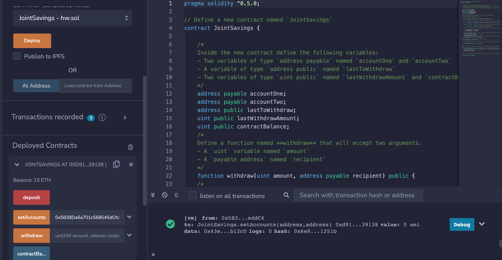
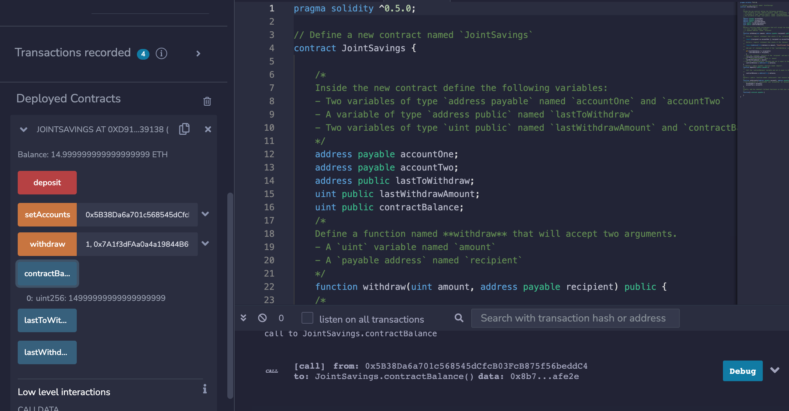
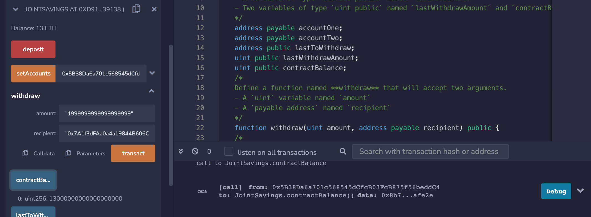
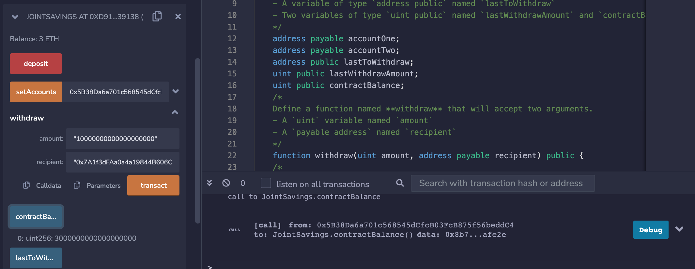
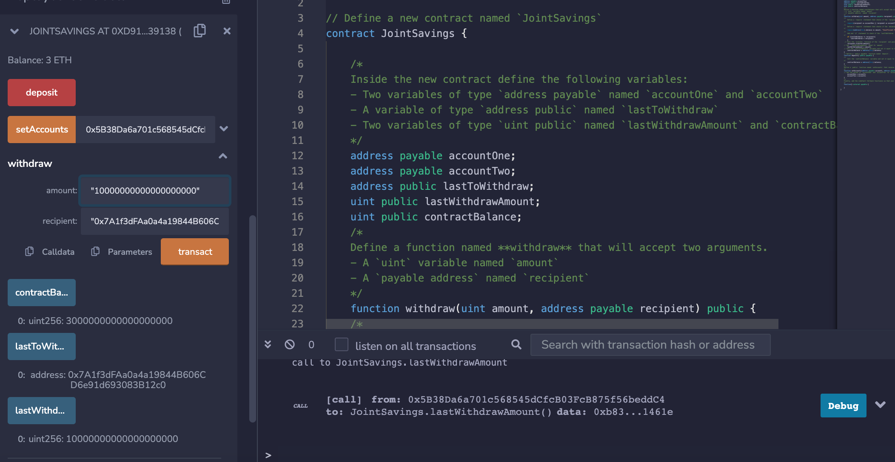

# Unit 20 - "Joint Savings Account"

### deposit 15 ETH and set accounts

### withdraw 1 wei

### withdraw 2 eth (balance 13 ETH)

### withdraw 10 eth (balance 3 ETH)

### withdraw to ACC# 2 , last withdrawal 10 ETH
